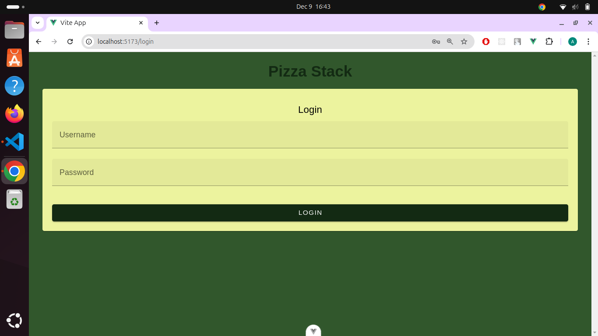
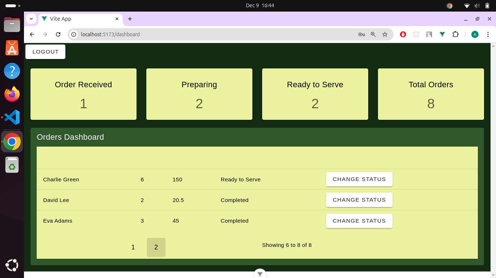

# pizza-stack

## screenshots


# Credentials
user: admin
password : root
## info

i have Created this project using the following technologies as discussed with people at your organisation and after reading the project document
1. vue 3
2. vuetify 3
3. vuex 4

## Recommended IDE Setup

[VSCode](https://code.visualstudio.com/) + [Volar](https://marketplace.visualstudio.com/items?itemName=Vue.volar) (and disable Vetur).

## Customize configuration

See [Vite Configuration Reference](https://vite.dev/config/).

## Project Setup

```sh
npm install
```

### Compile and Hot-Reload for Development

```sh
npm run dev
```

### Compile and Minify for Production

```sh
npm run build
```


